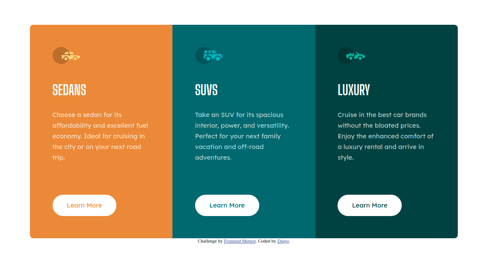

# Frontend Mentor - 3-column preview card component solution

This is a solution to the [3-column preview card component challenge on Frontend Mentor](https://www.frontendmentor.io/challenges/3column-preview-card-component-pH92eAR2-). Frontend Mentor challenges help you improve your coding skills by building realistic projects.

## Table of contents

- [Overview](#overview)
  - [The challenge](#the-challenge)
  - [Screenshot](#screenshot)
  - [Links](#links)
- [My process](#my-process)
  - [Built with](#built-with)
  - [What I learned](#what-i-learned)
  - [Continued development](#continued-development)
  - [Useful resources](#useful-resources)
- [Author](#author)

## Overview

### The challenge

Users should be able to:

- View the optimal layout depending on their device's screen size
- See hover states for interactive elements

### Screenshot

  

### Links

- Solution URL: [Github](https://github.com/magocbi/frontendmentor.io/tree/main/3-column-preview-card-component)
- Live Site URL: [Netlify](3-column-preview-card-component-magocbi.netlify.app)

## My process

### Built with

- Semantic HTML5 markup
- CSS custom properties
- Flexbox
- CSS Grid
- Mobile-first workflow

### What I learned

A bit more about flex layout. Using space-between to make sure buttons stay at the bottom regardless of text.

### Continued development

Responsive and JS.

### Useful resources

- [Stackoverflow](https://stackoverflow.com/questions/33887051/prevent-flex-items-from-stretching) - This helped me make button stop stretching and align it to the left at the same time.

## Author

- Frontend Mentor - [@magocbi](https://www.frontendmentor.io/profile/magocbi)
