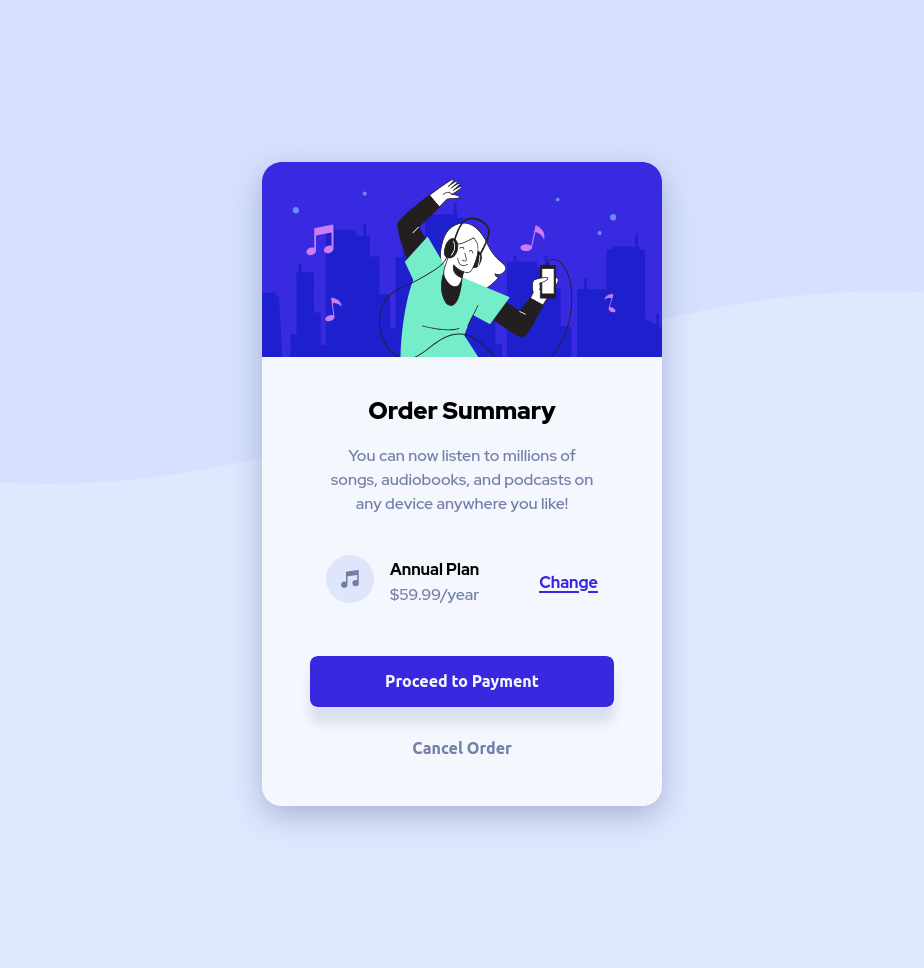

# Frontend Mentor - Order summary card solution

This is a solution to the [Order summary card challenge on Frontend Mentor](https://www.frontendmentor.io/challenges/order-summary-component-QlPmajDUj). Frontend Mentor challenges help you improve your coding skills by building realistic projects.

## Table of contents

- [Overview](#overview)
  - [The challenge](#the-challenge)
  - [Screenshot](#screenshot)
  - [Links](#links)
- [My process](#my-process)
  - [Built with](#built-with)
  - [What I learned](#what-i-learned)
  - [Continued development](#continued-development)
  - [Useful resources](#useful-resources)
- [Author](#author)

## Overview

### The challenge

Users should be able to:

- See hover states for interactive elements

### Screenshot

#### Mobile

#### Desktop

#### Hover states

### Links

- Solution URL: [Github](https://github.com/magocbi/fem-order-summary)
- Live Site URL: [Netlify](https://order-summary-component-magocbi.netlify.app/)

## My process

### Built with

- HTML5 markup
- CSS custom properties
- Flexbox
- Mobile-first workflow

### What I learned

- How to center the background image
- How to use background-size with percentages
- How to set the direction of the background image repeat

### Continued development

Responsiveness and interactivity(including JS). Styling in general.

### Useful resources

- [Stack Overflow](https://stackoverflow.com/questions/1734618/how-to-increase-the-gap-between-text-and-underlining-in-css) - This helped me with fixing the clipping on the underline of the anchor tag.
- [MDN repeat docs](https://developer.mozilla.org/en-US/docs/Web/CSS/background-repeat) - This helped me realize how to control image repeat direction.
- [MDN bg-size docs](https://developer.mozilla.org/en-US/docs/Web/CSS/background-size) - This helped me realize how to manipulate the image besides cover and contain.

## Author

- Frontend Mentor - [@magocbi](https://www.frontendmentor.io/profile/magocbi)
