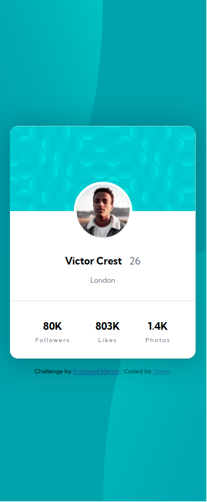

# Frontend Mentor - Profile card component solution

This is a solution to the [Profile card component challenge on Frontend Mentor](https://www.frontendmentor.io/challenges/profile-card-component-cfArpWshJ). Frontend Mentor challenges help you improve your coding skills by building realistic projects.

## Table of contents

- [Overview](#overview)
  - [The challenge](#the-challenge)
  - [Screenshot](#screenshot)
  - [Links](#links)
- [My process](#my-process)
  - [Built with](#built-with)
  - [What I learned](#what-i-learned)
  - [Continued development](#continued-development)
  - [Useful resources](#useful-resources)
- [Author](#author)
- [Acknowledgments](#acknowledgments)

## Overview

### The challenge

- Build out the project to the designs provided

### Screenshot

### Links

- Solution URL: [Github](https://github.com/magocbi/frontendmentor.io/tree/main/profile-card-component)
- Live Site URL: [Netlify](https://profile-card-component-magocbi.netlify.app/)

## My process

### Built with

- Semantic HTML5 markup
- CSS custom properties
- Flexbox
- Mobile-first workflow

### What I learned

A bit more about background image positioning.

### Continued development

Responsive design and JS.

### Useful resources

- [MDN background](https://developer.mozilla.org/en-US/docs/Web/CSS/background) - This helped me better position background image.

## Author

- Frontend Mentor - [@magocbi](https://www.frontendmentor.io/profile/magocbi)
